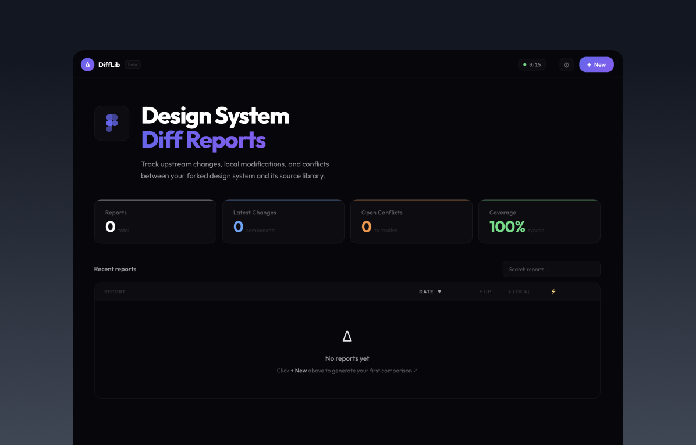
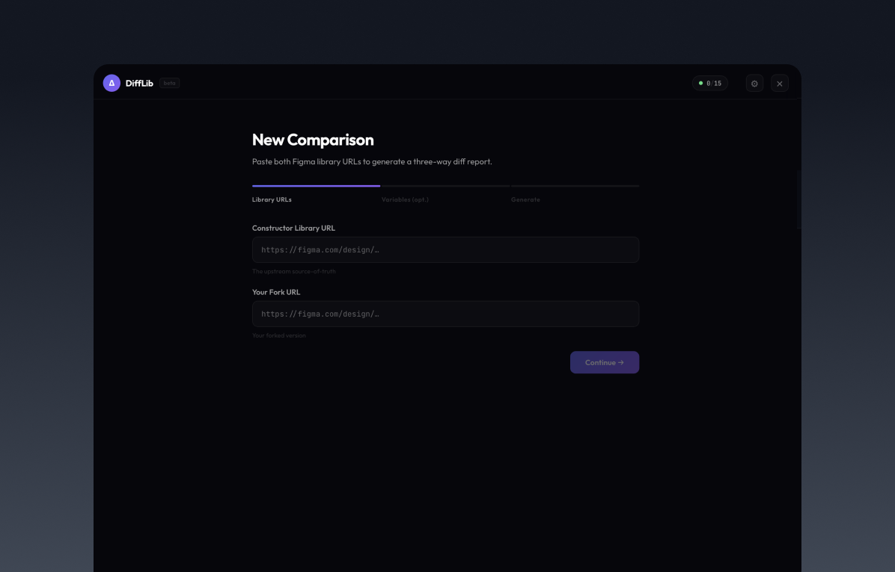
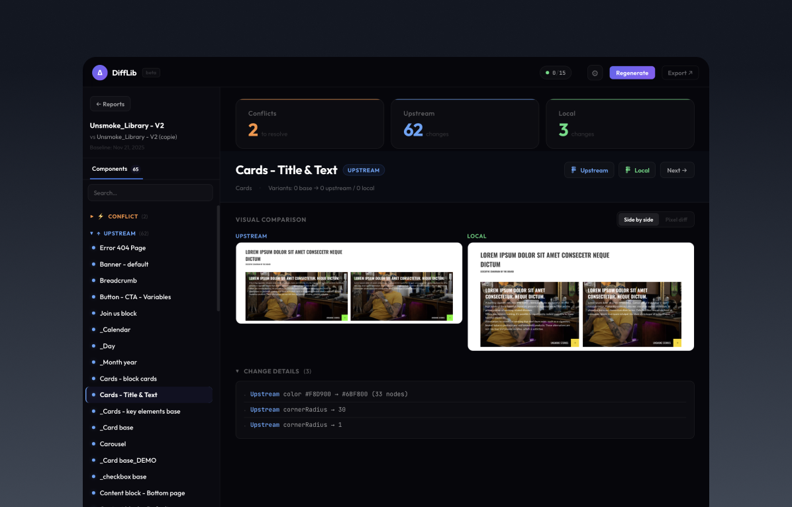

<p align="center">
  
</p>

<h1 align="center">Figma DS Diff Tool</h1>

<p align="center">
  <strong>Three-way diff engine for Figma design system libraries.</strong><br>
  Compare constructor &amp; fork. Detect upstream changes, local changes &amp; conflicts. Pixel-level visual diff.
</p>

<p align="center">
  <a href="#features">Features</a> &bull;
  <a href="#how-it-works">How It Works</a> &bull;
  <a href="#quick-start">Quick Start</a> &bull;
  <a href="#variable-export">Variable Export</a> &bull;
  <a href="#project-structure">Structure</a> &bull;
  <a href="#tech-stack">Tech Stack</a> &bull;
  <a href="#configuration">Configuration</a>
</p>

<p align="center">
  
  
  
  
  
  
</p>

---

<p align="center">
  
</p>

## Why?

When a design system library is **forked** in Figma, tracking what changed upstream vs. what was customized locally becomes impossible manually. DiffLib solves this:

| Problem | Solution |
|---------|----------|
| "What changed upstream since we forked?" | Three-way diff with automatic baseline resolution |
| "Did our local edits conflict with upstream?" | Conflict detection with side-by-side comparison |
| "Are the visual renders actually different?" | Pixel-level diff with pixelmatch |
| "I need to share the diff with my team" | Self-contained HTML reports, no server needed |
| "Setting up a diff tool is painful" | Paste two Figma URLs and click Generate |

---

## Features

- **Three-way structural diff** &mdash; Components, styles & variables compared across base / upstream / local with automatic change attribution
- **Two-way fallback** &mdash; Works even when no common version history exists between files
- **Pixel diff** &mdash; Side-by-side renders + pixelmatch overlay to spot visual regressions
- **Image lightbox** &mdash; Hover any render to zoom into a full-screen frosted-glass viewer
- **Rename detection** &mdash; Fuzzy matching catches renamed components instead of flagging delete + add
- **Variable diff** &mdash; Upload Figma variable JSON exports for two-way variable comparison
- **Self-contained reports** &mdash; Each report is an HTML folder with `data.json` + images &mdash; works offline, shareable
- **Regenerate** &mdash; One-click re-run from any report page with confirmation dialog and live progress
- **Real-time progress** &mdash; SSE-based live progress with step-by-step feedback during comparison
- **API quota tracking** &mdash; Live indicator in the navbar showing Figma API usage and rate limits
- **Settings UI** &mdash; Configure your Figma PAT from the browser, no server restart needed
- **100% local** &mdash; Your designs never leave your machine

---

## How It Works

```
Constructor (upstream)          Fork (local)
       |                            |
       v                            v
  Figma API ─────────────────── Figma API
       |                            |
  ┌────┴────┐                 ┌─────┴────┐
  │ Current │                 │ Current  │
  │ version │                 │ version  │
  └────┬────┘                 └─────┬────┘
       │          Base              │
       │     (constructor at        │
       │      fork time)            │
       │         │                  │
       v         v                  v
   ┌─────────────────────────────────┐
   │      Three-Way Diff Engine      │
   │  components + styles + variables │
   └──────────────┬──────────────────┘
                  │
                  v
   ┌──────────────────────────────────┐
   │    Pixel Diff (pixelmatch)       │
   │  upstream render vs local render │
   └──────────────┬───────────────────┘
                  │
                  v
   ┌──────────────────────────────────┐
   │     Self-Contained HTML Report   │
   │  report.html + data.json + imgs  │
   └──────────────────────────────────┘
```

<p align="center">
  
</p>

1. **Baseline resolution** &mdash; Walks version history to find the constructor version that matches the fork creation date
2. **Fetch & normalize** &mdash; Pulls file data for base, upstream, and local; strips volatile fields
3. **Diff** &mdash; Eight-case change attribution table: `upstream_changed`, `local_changed`, `conflict`, `new_upstream`, `new_local`, `deleted_upstream`, `deleted_local`, `renamed_*`
4. **Visual diff** &mdash; Renders components via Figma Images API, composites with pixelmatch (top-left aligned)
5. **Report** &mdash; Generates a portable HTML folder with all data and images embedded

---

## Quick Start

### Prerequisites

- **Node.js** 20+
- **pnpm** 9+
- **Figma Personal Access Token** &mdash; [Generate one here](https://www.figma.com/developers/api#access-tokens)

### Install

```bash
git clone https://github.com/vincegx/Figma-DS-DiffLib.git
cd Figma-DS-DiffLib
pnpm install
```

### Configure

```bash
cp .env.example .env
# Edit .env → FIGMA_PAT=figd_your_token_here
```

Or configure via the UI: start the dev server and go to **Settings**.

### Run

```bash
pnpm --filter @figma-ds-diff/web dev
# Open http://localhost:3000
```

### Generate a Report

1. Go to `/new`
2. Paste the **constructor** (upstream) Figma library URL
3. Paste the **fork** (local) Figma library URL
4. Optionally upload variable JSON exports
5. Click **Generate** and watch the live progress
6. View, zoom, and explore the report

---

## Variable Export

### Why is this needed?

The Figma REST API **does not expose variables** (design tokens). Unlike components and styles which DiffLib fetches automatically via the API, variables can only be accessed from within Figma itself using a plugin. This is a known limitation of Figma's public API.

To include variable diffs in your report, you need to **manually export** the variables from both files using a Figma plugin, then upload the two JSON files during step 2 of the comparison wizard.

### Recommended Plugin

[**Luckino &mdash; Variables Import/Export JSON & CSS**](https://www.figma.com/community/plugin/1495722115809572711/luckino-variables-import-export-json-css)

This plugin exports all variable collections in the **W3C Design Tokens Community Group (DTCG)** format, which is what DiffLib expects.

### How to Export

1. Open your **constructor** (upstream) Figma library file
2. Run the plugin: **Plugins &rarr; Luckino Variables Import/Export**
3. Select **Export** and choose **JSON** format
4. Export **all collections** &mdash; save the file (e.g. `variables_constructor.json`)
5. Open your **fork** (local) Figma library file
6. Repeat steps 2&ndash;4 &mdash; save as `variables_fork.json`

### Upload in DiffLib

During comparison setup (step 2 &mdash; "Variables"), drag & drop or select both JSON files:

- **First file** &rarr; constructor (upstream) variables
- **Second file** &rarr; fork (local) variables

This step is **optional** &mdash; you can skip it if you only need component and style diffs. Variable diffs are always two-way (constructor vs fork), since there is no version history for exported JSON.

### Expected Format

The JSON follows the DTCG structure &mdash; collections at the top level, variables nested with `$value` and `$type`:

```json
{
  "Tokens": {
    "Spacing": {
      "base_1(4)": { "$value": 4, "$type": "number" },
      "base_2(8)": { "$value": 8, "$type": "number" }
    },
    "Colors": {
      "primary": { "$value": "#6366F1", "$type": "color" }
    }
  }
}
```

> **Note:** When regenerating a report from the report page, variable diffs are skipped because the JSON files are not stored in the report. Re-upload them via `/new` if you need updated variable diffs.

---

## Project Structure

**pnpm monorepo** with two packages:

```
packages/
├── core/                          # @figma-ds-diff/core — pure TypeScript library
│   └── src/
│       ├── figma/                 # API client, Zod schemas, URL parser, quota tracker
│       ├── baseline/              # Version history baseline resolver
│       ├── normalize/             # Components, styles, variables, filters
│       ├── diff/                  # Three-way engine, visual diff, rename detection
│       ├── images/                # Batch PNG downloader (chunks of 50)
│       ├── report/                # Self-contained HTML report generator
│       └── index.ts               # Barrel exports
│
└── web/                           # @figma-ds-diff/web — Next.js 15 App Router UI
    └── src/
        ├── app/
        │   ├── api/compare/       # POST — SSE comparison orchestration
        │   ├── api/reports/       # GET — list & serve reports + images
        │   ├── api/quota/         # GET — API quota stats
        │   ├── api/settings/      # POST — runtime config (FIGMA_PAT)
        │   ├── new/               # Comparison wizard (3-step form)
        │   ├── report/[slug]/     # Report viewer
        │   └── settings/          # Settings page
        ├── components/
        │   ├── home/              # Hero, report table, stat cards
        │   ├── layout/            # NavBar with quota indicator
        │   ├── new/               # Wizard steps, live processing view
        │   ├── report/            # Sidebar, visual comparison, lightbox, pixel diff, regenerate
        │   ├── settings/          # Settings form
        │   └── shared/            # Reusable atoms (stat card, badges, dots)
        ├── hooks/                 # useApiQuota, useKeyboardNav
        └── lib/                   # Utils, data mapper, runtime config
```

---

## Tech Stack

| Layer | Technology |
|-------|-----------|
| **Runtime** | Node.js 20+, ESM everywhere |
| **Language** | TypeScript 5.7+ (`strict`, `noUncheckedIndexedAccess`, `verbatimModuleSyntax`) |
| **Package manager** | pnpm 9+ with workspaces |
| **Validation** | Zod v3 for all Figma API responses |
| **Image processing** | sharp (resize/composite) + pixelmatch (pixel diff) |
| **Testing** | Vitest 3 (170+ tests) |
| **Web framework** | Next.js 15 (App Router, Server Components) |
| **UI** | React 19, Tailwind CSS 4, Radix UI, shadcn/ui |
| **Charts** | Recharts (quota dashboard) |
| **HTTP** | Node.js built-in `fetch` (no axios) |

---

## Configuration

| Variable | Description | Required |
|----------|-------------|----------|
| `FIGMA_PAT` | Figma Personal Access Token | Yes |

Set in `.env` at the project root, or configure via the **Settings** page in the UI.

The token is read directly from the `.env` file (with a 5-second cache), so updates take effect without restarting the server.

---

## Key Commands

```bash
# Install dependencies
pnpm install

# Type check both packages
pnpm --filter @figma-ds-diff/core typecheck
pnpm --filter @figma-ds-diff/web typecheck

# Run tests (170+ tests)
pnpm --filter @figma-ds-diff/core test

# Dev server (port 3000)
pnpm --filter @figma-ds-diff/web dev

# Production build
pnpm --filter @figma-ds-diff/web build
```

---

## Report Format

Each report is a self-contained folder:

```
reports/2026-02-15_011200_Library_vs_Fork/
├── report.html     # Standalone HTML viewer
├── data.json       # All diff data (components, styles, variables, summary)
└── images/
    ├── component_name_upstream.png
    ├── component_name_local.png
    └── component_name_diff.png
```

<p align="center">
  
</p>

- **Portable** &mdash; open `report.html` directly in any browser
- **Shareable** &mdash; zip the folder and send it to your team
- **Regeneratable** &mdash; `data.json` stores file keys for one-click re-run

---

## Documentation

| Document | Description |
|----------|-------------|
| [CLAUDE.md](CLAUDE.md) | Developer guide &mdash; architecture, conventions, pitfalls |
| [docs/SPEC.md](docs/SPEC.md) | Technical specification &mdash; diff algorithm, change attribution |
| [docs/UI-SPEC.md](docs/UI-SPEC.md) | UI specification &mdash; design system, component patterns |

---

## License

MIT

---

<p align="center">
  <sub>Built for design system teams managing Figma library forks.</sub>
</p>
